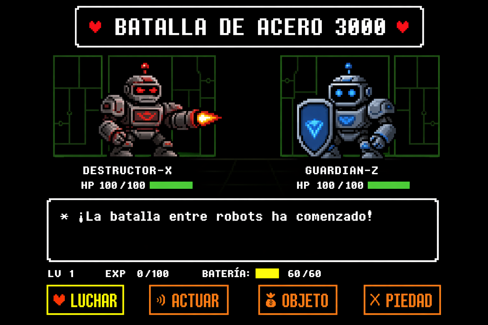

# 🤖 BATALLA DE ACERO 3000

## Descripción

**Batalla de Acero 3000** es un programa en Python desarrollado con **Programación Orientada a Objetos (POO)**.  
Simula una batalla automática entre dos robots con habilidades diferentes:

- **RobotAtaque**: puede atacar y reducir el escudo del enemigo.
- **RobotDefensa**: puede recargar su escudo para resistir más tiempo.

El juego se ejecuta solo, mostrando en pantalla cada acción y el estado de los robots hasta que se define un ganador.

---

## Características

- Uso de **clases y herencia**
- Métodos especializados en cada robot
- Simulación automática
- Uso de números aleatorios para daño y recarga
- Resultados dinámicos en cada ejecución

---

## Estructura del programa

### Clase base: `Robot`

Contiene los atributos principales:

- `nombre`
- `bateria`
- `escudo`

Y métodos para:

- obtener valores (*getters*)
- modificar valores (*setters*)
- mostrar estado del robot

---

### Subclase: `RobotAtaque`

Método especial:

- `atacar(objetivo)`

Reduce el escudo del robot enemigo y consume batería.

---

### Subclase: `RobotDefensa`

Método especial:

- `recargar()`

Aumenta el escudo del robot y consume batería.

---

